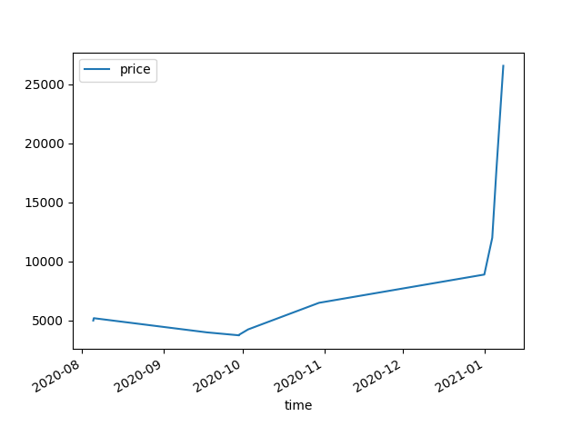

# chartcards
Map transaction data across crypto trading cards (NBA Top Shot support first then Sorare)

## NBA Top Shot

### Scraping

#### Moments
Use moments.py to scrape a spreadsheet with all loaded moments. It recursively loads them by iterating through paginations of NBA Top Shot's GraphQL API. Making the limit massive or 0 could cause errors which is why recursively scraping them is the method employed.

#### Transactions 
Use transactions.py to scrape a spreadsheet with all transactions ever done through the NBA Top Shot marketplace. Viewing all transactions through Flow is possible but it lacks price data, which causes a loss of utility.   

 

### Analysis

Functions in this section are very much a work in progress at the moment. However, they provide basic functionality that is very useful for visualizing prices which is not available through the NBA Top Shot site. There are also functions for trying to find notable percentage gains over time periods which could inform of market trends.   

This graph provides an insight into a moment that has absolutely skyrocketed in value, setting the Top Shot sale record at $26,543

## Sorare

Coming soon!